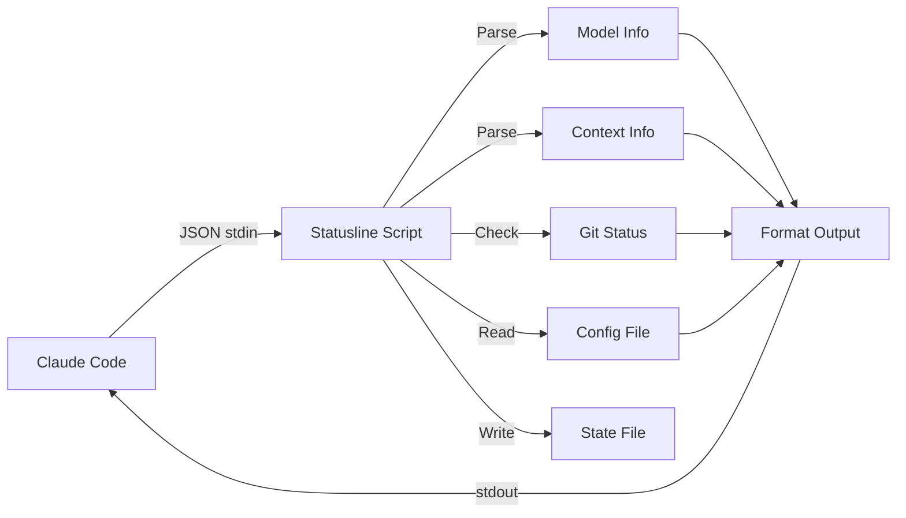

# Available Scripts

## Overview

| Script | Platform | Requirements | Features |
|--------|----------|--------------|----------|
| `statusline-full.sh` | macOS, Linux | `jq` | Full-featured with all indicators |
| `statusline-git.sh` | macOS, Linux | `jq` | Git branch and changes |
| `statusline-minimal.sh` | macOS, Linux | `jq` | Model + directory only |
| `statusline.py` | All | Python 3 | Cross-platform, full-featured |
| `statusline.js` | All | Node.js | Cross-platform, full-featured |
| `token-graph.sh` | macOS, Linux | None | Token usage visualization |

## Bash Scripts

### statusline-full.sh (Recommended)

Complete status line with all features:
- Model name
- Current directory
- Git branch and changes
- Token usage with color coding
- Token delta tracking
- Autocompact indicator
- Session ID

### statusline-git.sh

Lighter version with git info:
- Model name
- Current directory
- Git branch and changes

### statusline-minimal.sh

Minimal footprint:
- Model name
- Current directory

## Cross-Platform Scripts

### statusline.py

Python implementation matching `statusline-full.sh` functionality. Works on Windows, macOS, and Linux without additional dependencies beyond Python 3.

### statusline.js

Node.js implementation matching `statusline-full.sh` functionality. Works on all platforms with Node.js installed.

## Utility Scripts

### token-graph.sh

Standalone CLI tool for visualizing token consumption. See [Token Graph](token-graph.md) for details.

## Output Format

All statusline scripts produce consistent output:

```
[Model] directory | branch [changes] | XXk free (XX%) [+delta] [AC:XXk] session_id
```

## Architecture



## Input Format

Scripts receive JSON via stdin from Claude Code:

```json
{
  "model": {
    "display_name": "Opus 4.5"
  },
  "cwd": "/path/to/project",
  "session_id": "abc123",
  "context": {
    "tokens_remaining": 64000,
    "context_window": 200000,
    "autocompact_buffer_tokens": 45000
  }
}
```

## Color Codes

All scripts use consistent ANSI colors:

| Color | Code | Usage |
|-------|------|-------|
| Blue | `\033[0;34m` | Directory |
| Magenta | `\033[0;35m` | Git branch |
| Cyan | `\033[0;36m` | Changes count |
| Green | `\033[0;32m` | High availability (>50%) |
| Yellow | `\033[0;33m` | Medium availability (>25%) |
| Red | `\033[0;31m` | Low availability (<=25%) |
| Dim | `\033[2m` | Model, AC indicator |
| Reset | `\033[0m` | Reset formatting |
